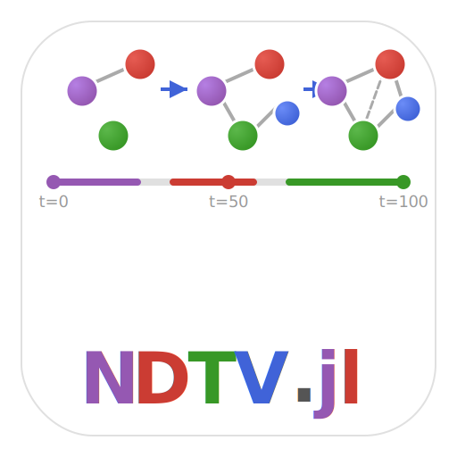

# NDTV.jl


[](https://github.com/statistical-network-analysis-with-Julia/NDTV.jl)
[](https://github.com/statistical-network-analysis-with-Julia/NDTV.jl/actions/workflows/CI.yml?query=branch%3Amain)
[](https://statistical-network-analysis-with-Julia.github.io/NDTV.jl/stable/)
[](https://statistical-network-analysis-with-Julia.github.io/NDTV.jl/dev/)
[](https://julialang.org/)
[](https://opensource.org/licenses/MIT)

<p align="center">
  
</p>

Network Dynamic Temporal Visualization for Julia.

## Overview

NDTV.jl provides tools for visualizing dynamic networks including animations, timeline plots, filmstrip displays, and layout algorithms for time-varying network data.

This package is a Julia port of the R `ndtv` package from the StatNet collection.

## Installation

```julia
using Pkg
Pkg.add(url="https://github.com/statistical-network-analysis-with-Julia/NDTV.jl")
```

## Features

- **Animation**: Compute layouts for smooth network animations
- **Timeline plots**: Visualize activity over time
- **Filmstrip**: Multiple snapshots side-by-side
- **Layout algorithms**: Fruchterman-Reingold, circular, random
- **Export**: HTML, video, and GIF output (with external tools)

## Quick Start

```julia
using NetworkDynamic
using NDTV

# Create dynamic network
dnet = DynamicNetwork(10; observation_start=0.0, observation_end=100.0)
# ... add activity spells ...

# Compute animation layout
layout = render_animation(dnet; n_frames=50)

# Create timeline plot
timeline_plot(dnet)

# Generate filmstrip
frames = filmstrip(dnet, [0.0, 25.0, 50.0, 75.0, 100.0])
```

## Layout Computation

### Animation Layout

```julia
# Compute layouts for animation
layout = render_animation(dnet;
    algorithm=FRLayout(),
    n_frames=100,
    interpolation=:linear
)

# Access frame data
layout[i]        # Positions at frame i
layout.times     # Time points
layout.bounds    # (xmin, xmax, ymin, ymax)
```

### Layout Algorithms

```julia
# Fruchterman-Reingold (force-directed)
FRLayout(; iterations=100, cooling=0.95, k=1.0)

# Circular layout
CircleLayout(; radius=1.0, start_angle=0.0)

# Random layout
RandomLayout(; xmin=0.0, xmax=1.0, ymin=0.0, ymax=1.0)

# Kamada-Kawai
KKLayout(; iterations=100, epsilon=1e-4)
```

### Single Snapshot Layout

```julia
# Layout at specific time
positions = compute_slice_layout(dnet, time; algorithm=FRLayout())
# Returns Dict{vertex => (x, y)}
```

### Layout Sequence

```julia
# Layouts at multiple time points with anchoring
times = collect(0.0:10.0:100.0)
layout = layout_sequence(dnet, times;
    algorithm=FRLayout(),
    anchor=true  # Use previous layout as starting point
)
```

## DynamicLayout Type

```julia
struct DynamicLayout{T}
    positions::Vector{Dict{T, Tuple{Float64, Float64}}}
    times::Vector{Float64}
    bounds::Tuple{Float64, Float64, Float64, Float64}
end

length(layout)   # Number of frames
layout[i]        # Positions at frame i
```

## Interpolated Layout

```julia
# Smooth interpolation between computed frames
interp = InterpolatedLayout(base_layout; interpolation=:linear)
interp = InterpolatedLayout(base_layout; interpolation=:ease)

# Get position at any time
pos = get_position(interp, vertex, time)
```

## Timeline Visualization

### Timeline Plot

```julia
# ASCII timeline showing activity
timeline_plot(dnet; width=60)

# Output:
# Timeline: 0.0 to 100.0
# ============================================================
# Vertices:
# V1: |────────────                                          |
# V2: |    ────────────────                                  |
# Edges:
# 1→2: |      ══════════                                      |
```

### Proximity Timeline

```julia
# Ego-centric timeline
proximity_timeline(dnet, vertex; width=60)
```

### Transmission Timeline

```julia
# For epidemic/diffusion visualization
transmissions = [(from, to, time), ...]
transmissionTimeline(dnet, transmissions)
```

### Timeline Data

```julia
# Extract data for custom plotting
data = timeline_data(dnet)
data.vertices  # (vertex, onset, terminus) tuples
data.edges     # (source, target, onset, terminus) tuples
```

## Filmstrip

```julia
# Multiple snapshots
times = [0.0, 25.0, 50.0, 75.0, 100.0]
frames = filmstrip(dnet, times; algorithm=FRLayout())

# Each frame contains:
# (time, positions, n_vertices, n_edges)

# Slice layout over interval
frames = slice_layout(dnet, onset, terminus; n_slices=5)
```

## Export

### HTML (Interactive)

```julia
export_html(layout, "animation.html";
    config=HTMLConfig(width=800, height=600, controls=true)
)
```

### Video

```julia
# Requires FFmpeg
export_movie(layout, "animation.mp4";
    config=VideoConfig(fps=30, width=800, height=600)
)
```

### GIF

```julia
# Requires ImageMagick
export_gif(layout, "animation.gif";
    config=GIFConfig(fps=10, width=400, height=400)
)
```

## Example: Visualizing Network Evolution

```julia
using NetworkDynamic
using NDTV

# Create dynamic network
dnet = DynamicNetwork(20; observation_start=0.0, observation_end=100.0)

# Add some dynamics
for i in 1:20
    activate!(dnet, 0.0, 100.0; vertex=i)
end

# Edges appear and disappear
activate!(dnet, 0.0, 30.0; edge=(1, 2))
activate!(dnet, 20.0, 60.0; edge=(2, 3))
activate!(dnet, 40.0, 80.0; edge=(3, 4))

# Create animation
layout = render_animation(dnet; n_frames=100)

# Show timeline
timeline_plot(dnet)

# Export
export_html(layout, "network_evolution.html")
```

## Example: Epidemic Spread

```julia
# Visualize disease transmission
transmissions = [
    (1, 2, 5.0),   # Person 1 infects 2 at t=5
    (2, 3, 12.0),  # Person 2 infects 3 at t=12
    (2, 4, 15.0),  # Person 2 infects 4 at t=15
]

transmissionTimeline(dnet, transmissions)
```

## Documentation

For more detailed documentation, see:

- [Stable Documentation](https://statistical-network-analysis-with-Julia.github.io/NDTV.jl/stable/)
- [Development Documentation](https://statistical-network-analysis-with-Julia.github.io/NDTV.jl/dev/)

## References

1. Bender-deMoll, S. (2023). ndtv: Network Dynamic Temporal Visualizations. R package. [https://cran.r-project.org/package=ndtv](https://cran.r-project.org/package=ndtv)

2. Bender-deMoll, S., & McFarland, D.A. (2006). The Art and Science of Dynamic Network Visualization. *Journal of Social Structure*, 7(2), 1-38.

## License

MIT License - see [LICENSE](LICENSE) for details.
